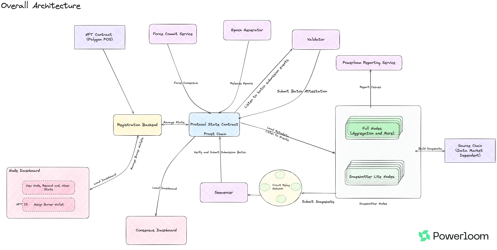
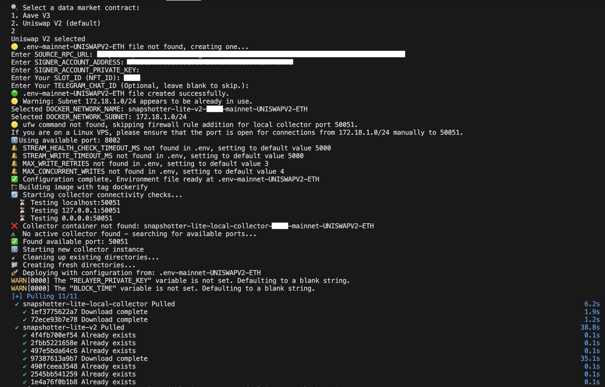
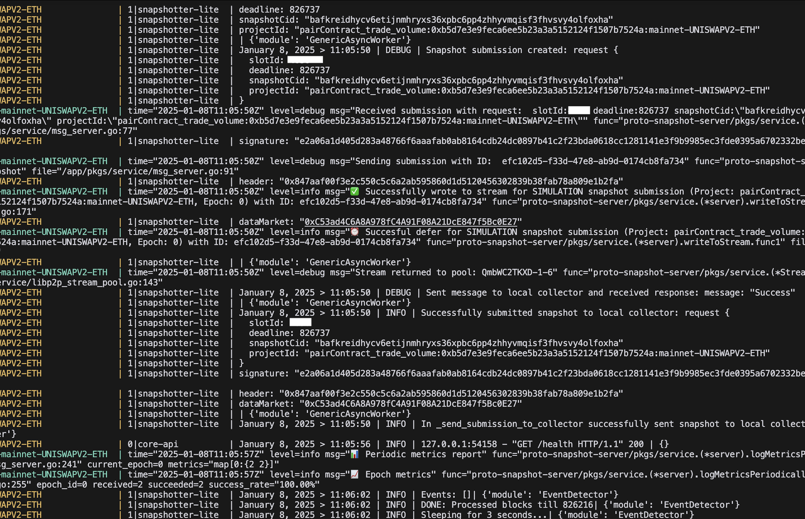

## Table of Contents
- [Table of Contents](#table-of-contents)
- [Overview](#overview)
    - [Features Unavailable in Snapshotter Lite Node](#features-unavailable-in-snapshotter-lite-node)
  - [Epoch Generation](#epoch-generation)
  - [Snapshot Generation](#snapshot-generation)
  - [Snapshot Finalization](#snapshot-finalization)
- [Major Components](#major-components)
  - [System Event Detector](#system-event-detector)
  - [Processor Distributor](#processor-distributor)
  - [RPC Helper](#rpc-helper)
  - [Core API](#core-api)
  - [Local Collector](#local-collector)
- [Setup](#setup)
  - [Using Docker](#using-docker)
    - [Setting up multi data market release for the first time](#setting-up-multi-data-market-release-for-the-first-time)
    - [Running from a previously configured multi data market release](#running-from-a-previously-configured-multi-data-market-release)
    - [Simulation submissions](#simulation-submissions)
- [Monitoring and Debugging](#monitoring-and-debugging)
  - [Monitoring](#monitoring)
  - [Debugging](#debugging)
- [For Contributors](#for-contributors)
- [Case Studies](#case-studies)
  - [1. Pooler: Case study and extending this implementation](#1-pooler-case-study-and-extending-this-implementation)
    - [Extending pooler with a Uniswap v2 data point](#extending-pooler-with-a-uniswap-v2-data-point)
      - [Step 1. Review: Base snapshot extraction logic for trade information](#step-1-review-base-snapshot-extraction-logic-for-trade-information)
- [Find us](#find-us)

## Overview



A snapshotter peer as part of Powerloom Protocol does exactly what the name suggests:  It synchronizes with other snapshotter peers over a smart contract running on Powerloom Prost chain. It follows an architecture that is driven by state transitions which makes it easy to understand and modify.

Because of its decentralized nature, the snapshotter specification and its implementations share some powerful features that can adapt to your specific information requirements on blockchain applications:

* Each data point is calculated, updated, and synchronized with other snapshotter peers participating in the network
* synchronization of data points is defined as a function of an epoch ID(identifier) where epoch refers to an equally spaced collection of blocks on the data source blockchain (for eg, Ethereum Mainnet/Polygon Mainnet/Polygon Testnet -- Mumbai). This simplifies the building of use cases that are stateful (i.e. can be accessed according to their state at a given height of the data source chain), synchronized, and depend on reliable data. For example,
    * dashboards by offering higher-order aggregate datapoints
    * trading strategies and bots
* a snapshotter peer can load past epochs, indexes, and aggregates from a decentralized state and have access to a rich history of data
    * all the datasets are decentralized on IPFS/Filecoin
    * the power of these decentralized storage networks can be leveraged fully by applying the [principle of composability](#aggregation-and-data-composition---snapshot-generation-of-higher-order-datapoints-on-base-snapshots)

Snapshotter Lite Node is a lightweight implementation of the [Snapshotter Peer](https://github.com/PowerLoom/pooler/tree/main) that can be used to build simpler use cases that do not require the full functionality of the Snapshotter Peer. Snapshotter Lite Node only has a single dependency on Python environment and hence has significantly lower resource requirements than the Snapshotter Peer. It is suitable for use cases where no aggregation is required and the data can be directly used from the base snapshots.

Architecturally, the Snapshotter Lite Node is similar to the [Snapshotter Peer](https://github.com/PowerLoom/pooler/tree/main), it still has the same modular and highly configurable architecture, allowing for easy customization and seamless integration. It consists of three core components:

1. **Main Snapshotter Codebase**:
   - This foundational component defines all the essential interfaces and handles a wide range of tasks, from listening to epoch release events to distributing tasks and managing snapshot submissions.

2. **Configuration Files**:
   - Configuration files, located in the `/config` directory are linked to [snapshotter-configs](https://github.com/PowerLoom/snapshotter-configs/) repo, play a pivotal role in defining project types, specifying paths for individual compute modules, and managing various project-related settings.

3. **Compute Modules**:
   - The heart of the system resides in the `snapshotter/modules` directory are linked to [snapshotter-computes](https://github.com/PowerLoom/snapshotter-computes/), where the actual computation logic for each project type is defined. These modules drive the snapshot generation process for specific project types.


The architecture has been designed to facilitate the seamless interchange of configuration and modules. To achieve this, we maintain these components in separate Git repositories, which are then integrated into the Snapshotter Peer using Git Submodules. As a result, adapting the system to different use cases is as straightforward as changing a Git branch, offering unparalleled flexibility and versatility.

For more information on using Git Submodules, please refer to the [Git Submodules Documentation](https://git-scm.com/book/en/v2/Git-Tools-Submodules).


#### Features Unavailable in Snapshotter Lite Node
Snapshotter Lite Node is a lightweight implementation of the Snapshotter Peer and hence does not support the following features:
- [Aggregation and data composition](https://github.com/PowerLoom/pooler/tree/main?tab=readme-ov-file#state-transitions-and-data-composition)
- Redis Caching
- Worker Pool for parallel processing
- [Preloading Architecture](https://github.com/PowerLoom/pooler/tree/main?tab=readme-ov-file#preloading)
- [Epoch Processing state transitions](https://github.com/PowerLoom/pooler/tree/main?tab=readme-ov-file#preloading)
- [Internal Status APIs](https://github.com/PowerLoom/pooler/tree/main?tab=readme-ov-file#preloading)
- [Data Source Signalling](https://github.com/PowerLoom/pooler/tree/main?tab=readme-ov-file#state-transitions-and-data-composition)

If you require any of these features, please consider using the [Snapshotter Peer](https://github.com/PowerLoom/pooler/tree/main) instead. If you are unsure about which implementation to use, please reach out to us on [Discord](https://powerloom.io/discord) and we will be happy to help you out.
### Epoch Generation

An epoch denotes a range of block heights on the EVM-compatible data source blockchain, for eg Ethereum mainnet/Polygon PoS mainnet/testnet. This makes it easier to collect state transitions and snapshots of data on equally spaced block height intervals, as well as to support future work on other lightweight anchor proof mechanisms like Merkle proofs, succinct proofs, etc.

The size of an epoch is configurable. Let that be referred to as `size(E)`

- A [trusted service](https://github.com/PowerLoom/epoch-manager) keeps track of the head of the chain as it moves ahead, and a marker `h₀` against the max block height from the last released epoch. This makes the beginning of the next epoch, `h₁ = h₀ + 1`

- Once the head of the chain has moved sufficiently ahead so that an epoch can be published, an epoch finalization service takes into account the following factors
    - chain reorganization reports where the reorganized limits are a subset of the epoch qualified to be published
    - a configurable ‘offset’ from the bleeding edge of the chain

 and then publishes an epoch `(h₁, h₂)` by sending a transaction to the protocol state smart contract deployed on the Prost Chain (anchor chain) so that `h₂ - h₁ + 1 == size(E)`. The next epoch, therefore, is tracked from `h₂ + 1`.

 Each such transaction emits an `EpochReleased` event

 ```
 event EpochReleased(uint256 indexed epochId, uint256 begin, uint256 end, uint256 timestamp);
 ```

 The `epochId` here is incremented by 1 with every successive epoch release.


### Snapshot Generation

Processors as configured in `config/projects.json` calculate snapshots for each task type based on the filtering or any criteria defined for snapshot generation against this `epochId` which corresponds to collections of state observations and event logs between the blocks at height in the range `[begin, end]`.

The project ID is ultimately generated in the following manner:

https://github.com/PowerLoom/snapshotter-lite-v2/blob/2fa7e0922d85b2529ecc4b17c95748cda1cad96f/snapshotter/utils/snapshot_worker.py#L41

 The snapshots generated are the fundamental data models on which higher-order aggregates and richer data points are built (By [Full Nodes](https://github.com/PowerLoom/deploy))

For situations where data sources are constantly changing or numerous, it is impractical to maintain an extensive list of them. In such cases, specific data sources need not be defined explicitly. You can just define a filtering criteria for the data source contract address and the snapshotter will automatically generate snapshots for all data sources that match the criteria.

For complex use cases with a lot of data requirements, it is recommended to use the [Snapshotter Peer](https://github.com/PowerLoom/pooler/tree/main) instead of the Snapshotter Lite Node because it employs a more efficient and scalable architecture.


 ### Snapshot Finalization

All snapshots per project reach consensus on the protocol state contract which results in a `SnapshotFinalized` event being triggered.

```
event SnapshotFinalized(uint256 indexed epochId, uint256 epochEnd, string projectId, string snapshotCid, uint256 timestamp);
```


## Major Components
The Snapshotter Lite Node consists of the following major components:

### System Event Detector

System Event Detector, defined in [`system_event_detector.py`](snapshotter/system_event_detector.py), is the main entry point for Snapshotter Lite Node. It tracks events being triggered on the protocol state contract running on the anchor chain and calls appropriate classes to handle them.

Events being tracked by the system event detector are:
- `EpochReleased` - This event is emitted by the Protocol State Contract when an epoch is released. It is used to trigger the snapshot generation process.
- `allSnapshottersUpdated` - This event is emitted by the Protocol State Contract when a new snapshotter peer is added or removed from the network. It is used to enable or disable the snapshot generation process (Might be removed closer to mainnet).
- `DailyTaskCompletedEvent` - Each snapshotter lite peer needs to complete a daily task to be eligible for rewards. This event is emitted by the Protocol State Contract when a snapshotter lite peer completes its daily task, making it inactive for the rest of the day.
- `DayStartedEvent` - This event is emitted by the Protocol State Contract when a new day starts. This is used to re-enable the snapshot generation process for all snapshotter lite peers.

### Processor Distributor
The Processor Distributor, defined in [`processor_distributor.py`](snapshotter/processor_distributor.py), acts upon the events received from the System Event Detector and distributes the processing tasks to the appropriate snapshot processors. It is also responsible for acting on `allSnapshottersUpdated`, `DailyTaskCompletedEvent` and `DayStartedEvent` events to manage the snapshot generation process.

https://github.com/PowerLoom/snapshotter-lite-v2/blob/2fa7e0922d85b2529ecc4b17c95748cda1cad96f/snapshotter/processor_distributor.py#L283

### RPC Helper

Extracting data from the blockchain state and generating the snapshot can be a complex task. The `RpcHelper`, defined in [`utils/rpc.py`](snapshotter/utils/rpc.py), has a bunch of helper functions to make this process easier. It handles all the `retry` and `caching` logic so that developers can focus on efficiently building their use cases.


### Core API

This component is one of the most important and allows you to access the finalized protocol state on the smart contract running on the anchor chain. Find it in [`core_api.py`](snapshotter/core_api.py).

The [pooler-frontend](https://github.com/powerloom/pooler-frontend) that serves the Uniswap v2 dashboards hosted by the PowerLoom foundation on locations like https://uniswapv2.powerloom.io/ is a great example of a frontend specific web application that makes use of this API service.

Among many things, the core API allows you to **access the finalized CID as well as its contents at a given epoch ID for a project**.

The main endpoint implementations can be found as follows:

https://github.com/PowerLoom/snapshotter-lite-v2/blob/2fa7e0922d85b2529ecc4b17c95748cda1cad96f/snapshotter/core_api.py#L237

https://github.com/PowerLoom/snapshotter-lite-v2/blob/2fa7e0922d85b2529ecc4b17c95748cda1cad96f/snapshotter/core_api.py#L293

The first endpoint in `GET /last_finalized_epoch/{project_id}` returns the last finalized EpochId for a given project ID and the second one is `GET /data/{epoch_id}/{project_id}/` which can be used to return the actual snapshot data for a given EpochId and ProjectId.

These endpoints along with the combination of a bunch of other helper endpoints present in `Core API` can be used to build powerful Dapps and dashboards.

You can observe the way it is [used in `pooler-frontend` repo](https://github.com/PowerLoom/pooler-frontend/blob/361268d27584520450bf33353f7519982d638f8a/src/routes/index.svelte#L85) to fetch the dataset for the aggregate projects of top pairs trade volume and token reserves summary:


```javascript
try {
      response = await axios.get(API_PREFIX+`/data/${epochInfo.epochId}/${top_pairs_7d_project_id}/`);
      console.log('got 7d top pairs', response.data);
      if (response.data) {
        for (let pair of response.data.pairs) {
          pairsData7d[pair.name] = pair;
        }
      } else {
        throw new Error(JSON.stringify(response.data));
      }
    }
    catch (e){
      console.error('7d top pairs', e);
    }
```

### Local Collector

The local collector is a separate containerized component that receives snapshot submissions from the snapshotter node over gRPC (port 50051 by default). It acts as an intermediary service that handles the reliable delivery of snapshots to the protocol's sequencer based on the data market contract configuration.

This architecture separates the resource-intensive computation of snapshots (handled by the snapshotter's compute modules) from the submission process (handled by the collector). The collector container can be shared across multiple snapshotter instances and will be automatically spawned if not already running.

* Read more on Powerloom Docs: [Local Collector](https://docs.powerloom.io/docs/Protocol/Specifications/Snapshotter/local-collector)

## Setup
There are multiple ways to set up the Snapshotter Lite Node. You can either use the Docker image or run it directly on your local machine.
However, it is recommended to use the Docker image as it is the easiest and most reliable way to set up the Snapshotter Lite Node.

### Using Docker

> [!IMPORTANT]
> It is recommended to run `build.sh` in a screen or tmux session so that the process continues running even after you close the terminal. The steps look like the following with `GNU screen` on linux:
> 
> * Start a new session by running the command `screen -S snapshotter-lite-node-mainnet`
> * Run the `build.sh` script by running the command `./build.sh`
> * Detach from the session by running the command `Ctrl+A+D`
> * You can reattach to the session by running the command `screen -r snapshotter-lite-node-mainnet` or `screen -rx snapshotter-lite-node-mainnet`

1. Install Docker on your machine. You can find the installation instructions for your operating system on the [official Docker website](https://docs.docker.com/get-docker/).

2. Clone this repository using the following command:
   ```bash
   git clone https://github.com/PowerLoom/snapshotter-lite-v2.git powerloom-mainnet
   ```
    This will clone the repository into a directory named `powerloom-mainnet`.

3. Change your working directory to the `powerloom-mainnet` directory:
   ```bash
   cd powerloom-mainnet
   ```

4. Run the diagnose and cleanup script to check for any previous instances of the lite node, local collector and stale images and networks.
    ```bash
    ./diagnose.sh -y
    ```
> [!IMPORTANT]
> The `-y` flag will automatically answer `yes` to all the prompts and do an automatic cleanup. This is useful and totally recommended.

1. Run `build.sh` to start the snapshotter lite node:
    ```bash
    ./build.sh
    ```


> [!NOTE]
> The lite node now allows you to choose between two data markets: Uniswap V2 and Aave V3 with Uniswap V2 being the default. This will be further  expanded to include more data markets in the future and to allow node operators to choose the data market they want to operate on.

After running `./build.sh`, your setup steps will appear slightly different based on whether you are setting up the multi data market release for the first time or not.

#### Setting up multi data market release for the first time

You will be prompted to choose the data market you want to operate on, followed by prompts to enter `SOURCE_RPC_URL`, `SIGNER_ACCOUNT_ADDRESS`, `SIGNER_ACCOUNT_PRIVATE_KEY` and `SLOT_ID`. 

This will create a namespace `.env-mainnet-<data_market_name>-ETH` file in the root directory of the project.



#### Running from a previously configured multi data market release


You will be prompted to choose whether you wish to change the previously configured values for the above: `SOURCE_RPC_URL`, `SIGNER_ACCOUNT_ADDRESS`, `SIGNER_ACCOUNT_PRIVATE_KEY` and `SLOT_ID`.


Choose `y` or `n` depending on whether you wish to change them.

#### Quick Devnet Setup

The `build.sh` script provides a `--devnet` flag for quick devnet deployment without manual configuration prompts.

To use this feature, run:
```bash
./build.sh --devnet
```

When the `--devnet` flag is used:
1. The script automatically configures for devnet chain
2. Uses devnet-specific defaults:
   - Devnet RPC URL: `https://rpc-devnet.powerloom.dev`
   - Devnet Protocol State Contract: `0x3B5A0FB70ef68B5dd677C7d614dFB89961f97401`
   - Devnet Data Market Contracts (Uniswap V2 by default)
3. Auto-selects existing devnet environment files (if multiple exist, uses the first one)
4. Skips chain selection prompts for faster setup
5. Sets `OVERRIDE_DEFAULTS=true` to preserve devnet configuration

You can combine this with other flags:
```bash
./build.sh --devnet --skip-credential-update
./build.sh --devnet --data-market-contract-number 1  # For Aave V3 on devnet
```

This is ideal for developers who frequently switch between mainnet and devnet environments.

##### Supported Data Markets on Devnet

The snapshotter lite node supports multiple data markets on devnet:

1. **Uniswap V2** (Default)
   - Contract: `0x8C3fDC3A281BbB8231c9c92712fE670eFA655e5f`
   - Branch: `eth_uniswapv2-lite_v2`

2. **Aave V3** 
   - Contract: `0x4229Ad271d8b11f2AdBDe77099752a534470876b`
   - Branch: `eth_aavev3_lite_v2`

When running with the `--devnet` flag, you'll be prompted to select a data market. You can also specify it directly:

```bash
# For Aave V3 on devnet
./build.sh --devnet --data-market-contract-number 1

# For Uniswap V2 on devnet (default)
./build.sh --devnet --data-market-contract-number 2
```

Each data market creates its own environment file (`.env-devnet-<DATAMARKET>-ETH`) to maintain separate configurations.

#### Overriding Default .env Generation

The `build.sh` script provides a mechanism to override the default generation of the `.env` file and customize various configuration parameters. This is useful when you need a specific setup that differs from the standard defaults or an existing `.env` configuration.

To use this feature, you can pass the `--override` flag when running the setup script (e.g. `./build.sh --override`)

When the `--override` flag is detected:
1.  The script will enter a custom configuration mode.
2.  You will be prompted to input values for:
    *   `POWERLOOM_CHAIN` (e.g., mainnet, devnet)
    *   `NAMESPACE` (e.g., UNISWAPV2, AAVEV3, or a custom name)
    *   `SOURCE_CHAIN` (e.g., ETH)
    *   `POWERLOOM_RPC_URL`
    *   `PROTOCOL_STATE_CONTRACT`
    *   `DATA_MARKET_CONTRACT` (this will be a direct input, not a selection)
    *   Custom configuration and compute repository branches (optional).
3.  Based on your inputs, a new `.env-<FULL_NAMESPACE>` file will be created or an existing one will be updated with these new override values. The `FULL_NAMESPACE` is derived from `POWERLOOM_CHAIN`, `NAMESPACE`, and `SOURCE_CHAIN`.
4.  The script will then prompt for essential credentials like `SOURCE_RPC_URL`, `SIGNER_ACCOUNT_ADDRESS`, `SIGNER_ACCOUNT_PRIVATE_KEY`, and `SLOT_ID` for this new or updated `.env` file.
5.  An `OVERRIDE_DEFAULTS=true` flag will be set in the generated `.env` file, ensuring these custom settings are preserved during subsequent runs unless `--override` is used again.

This allows for fine-grained control over the node's configuration directly from the command line during setup.

#### Simulation submissions

Once all the steps around network selection and local collector setup are complete, the installer will start the snapshotter node and you should see submissions against `epochId=0` in your terminal logs that denotes the node is able to send simulation submissions to the sequencer.



To stop the node, you can press `Ctrl+C` in the terminal where the node is running or `docker-compose down` in a new terminal window from the project directory.


## Monitoring and Debugging

### Monitoring

To enable Telegram reporting for snapshotter issues:
1. Open a new conversation with [@PowerloomReportingBot](https://t.me/PowerloomReportingBot) in the Telegram App.
2. Start the bot by typing the `/start` command in the chat. You will receive a response containing your `Chat ID` for the bot.
3. Enter the `Chat ID` when prompted on node startup.
4. You will now receive an error report whenever your node fails to process an epoch or snapshot.

### Debugging
Usually the easiest way to fix node related issues is to restart the node. If you're facing issues with the node, you can try going through the logs present in the `logs` directory. If you're unable to find the issue, you can reach out to us on [Discord](https://powerloom.io/discord) and we will be happy to help you out.

## For Contributors
We use [pre-commit hooks](https://pre-commit.com/) to ensure our code quality is maintained over time. For this contributors need to do a one-time setup by running the following commands.
* Install the required dependencies using `pip install -r dev-requirements.txt`, this will set up everything needed for pre-commit checks.
* Run `pre-commit install`

Now, whenever you commit anything, it'll automatically check the files you've changed/edited for code quality issues and suggest improvements.

## Case Studies

### 1. Pooler: Case study and extending this implementation

Pooler is a Uniswap specific implementation of what is known as a 'snapshotter' in the PowerLoom Protocol ecosystem. It synchronizes with other snapshotter peers over a smart contract running on the present version of the PowerLoom Protocol testnet. It follows an architecture that is driven by state transitions which makes it easy to understand and modify. This present release ultimately provide access to rich aggregates that can power a Uniswap v2 dashboard with the following data points:

- Total Value Locked (TVL)
- Trade Volume, Liquidity reserves, Fees earned
    - grouped by
        - Pair contracts
        - Individual tokens participating in pair contract
    - aggregated over time periods
        - 24 hours
        - 7 days
- Transactions containing `Swap`, `Mint`, and `Burn` events

#### Extending pooler with a Uniswap v2 data point

In this section, let us take a look at the data composition abilities of Pooler to build on the base snapshot being built that captures information on Uniswap trades.

##### Step 1. Review: Base snapshot extraction logic for trade information

Required reading:
* [Snapshot Generation](#snapshot-generation) and

As you can notice in [`config/projects.example.json`](https://github.com/PowerLoom/snapshotter-configs/blob/f46cc86cd08913014decf7bced128433442c8f84/projects.example.json), each project config needs to have the following components

- `project_type` (unique identifier prefix for the usecase, [used to generate project ID](#base-snapshot-generation))
- `projects` (smart contracts to extract data from, pooler can generate different snapshots from multiple sources as long as the Contract ABI is same)
- `processor` (the actual compuation logic reference, while you can write the logic anywhere, it is recommended to write your implementation in snapshotter/modules folder)

There's currently no limitation on the number or type of usecases you can build using snapshotter. Just write the Processor class and pooler libraries will take care of the rest.

```json
{
  "config": [{
      "project_type": "uniswap_pairContract_pair_total_reserves",
      "projects":[
        "0xb4e16d0168e52d35cacd2c6185b44281ec28c9dc",
        "0xae461ca67b15dc8dc81ce7615e0320da1a9ab8d5",
        "0x0d4a11d5eeaac28ec3f61d100daf4d40471f1852",
        "0x3041cbd36888becc7bbcbc0045e3b1f144466f5f",
        "0xd3d2e2692501a5c9ca623199d38826e513033a17",
        "0xbb2b8038a1640196fbe3e38816f3e67cba72d940",
        "0xa478c2975ab1ea89e8196811f51a7b7ade33eb11"
        ],
      "processor":{
        "module": "pooler.modules.uniswapv2.pair_total_reserves",
        "class_name": "PairTotalReservesProcessor"
      }
    },
    {
      "project_type": "uniswap_pairContract_trade_volume",
      "projects":[
        "0xb4e16d0168e52d35cacd2c6185b44281ec28c9dc",
        "0xae461ca67b15dc8dc81ce7615e0320da1a9ab8d5",
        "0x0d4a11d5eeaac28ec3f61d100daf4d40471f1852",
        "0x3041cbd36888becc7bbcbc0045e3b1f144466f5f",
        "0xd3d2e2692501a5c9ca623199d38826e513033a17",
        "0xbb2b8038a1640196fbe3e38816f3e67cba72d940",
        "0xa478c2975ab1ea89e8196811f51a7b7ade33eb11"
        ],
        "processor":{
          "module": "pooler.modules.uniswapv2.trade_volume",
          "class_name": "TradeVolumeProcessor"
        }
    }
  ]
}
```

If we take a look at the `TradeVolumeProcessor` class present at [`snapshotter/modules/computes/trade_volume.py`](https://github.com/PowerLoom/snapshotter-computes/blob/6fb98b1bbc22be8b5aba8bdc860004d35786f4df/trade_volume.py) it implements the interface of `GenericProcessorSnapshot` defined in [`snapshotter/utils/callback_helpers.py`](snapshotter/utils/callback_helpers.py).


There are a couple of important concepts here necessary to write your extraction logic:
* `compute` is the main function where most of the snapshot extraction and generation logic needs to be written. It receives the following inputs:
- `msg_obj` (`SnapshotProcessMessage` instance, contains all the necessary epoch related information to generate snapshots)
- `rpc_helper` ([`RpcHelper`](snapshotter/utils/rpc.py) instance to help with any calls to the data source contract's chain)
- `anchor_rpc_helper` ([`RpcHelper`](snapshotter/utils/rpc.py) instance to help with any calls to the protocol state contract's chain)
- `ipfs_reader` (async IPFS client to read the data from IPFS)
- `protocol_state_contract` (protocol state contract instance to read the finalized snapshot CID or anything else from the protocol state contract required for snapshot generation)

Output format can be anything depending on the usecase requirements. Although it is recommended to use proper [`pydantic`](https://pypi.org/project/pydantic/) models to define the snapshot interface.

The resultant output model in this specific example is `UniswapTradesSnapshot` as defined in the Uniswap v2 specific modules directory: [`utils/models/message_models.py`](https://github.com/PowerLoom/snapshotter-computes/blob/6fb98b1bbc22be8b5aba8bdc860004d35786f4df/utils/models/message_models.py#L47-L54). This encapsulates state information captured by `TradeVolumeProcessor` between the block heights of the epoch: `min_chain_height` and `max_chain_height`.


## Find us

* [Discord](https://powerloom.io/discord)
* [Twitter](https://twitter.com/PowerLoomHQ)
* [Github](https://github.com/PowerLoom)
* [Careers](https://wellfound.com/company/powerloom/jobs)
* [Blog](https://blog.powerloom.io/)
* [Medium Engineering Blog](https://medium.com/powerloom)
